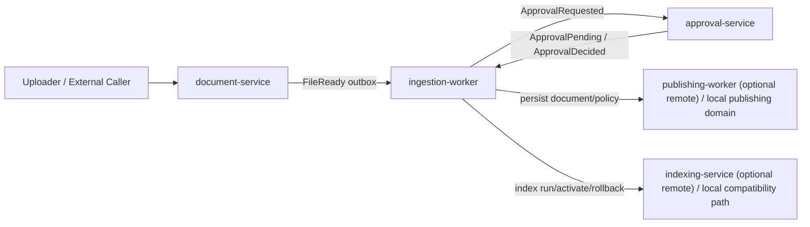

# intake-pipeline 对外关系总览

> 规范性状态：非规范文档。
>
> 本文是历史代码与过渡运行形态的现状快照，用来帮助理解旧实现，不是目标架构或实现依据。涉及 owner、发布事实源、manual review、indexing/retrieval 契约、生命周期语义时，必须以 [docs/上游机制移植总览.md](/E:/AI/My-Project/Reality-RAG/docs/上游机制移植总览.md)、[intake-pipeline.md](/E:/AI/My-Project/Reality-RAG/services/intake-pipeline/intake-pipeline.md)、[services/indexing/indexing.md](/E:/AI/My-Project/Reality-RAG/services/indexing/indexing.md)、[services/retrieval/retrieval.md](/E:/AI/My-Project/Reality-RAG/services/retrieval/retrieval.md) 为准。
>
> 任何 agent 不得根据本文新增依赖 `documents` / `document_policies` 作为发布事实源，不得延续 `admin-api:/admin/manual-review/*` 旁路，不得把本文描述的旧服务关系当作最终边界。
>
> 任何 agent 也不得把本文中的当前 HTTP 路由、当前落库表、当前 worker 组合或当前过渡闭环，当成新的兼容契约来源；它们只描述历史现状，不描述未来必须兼容的 seam。

面向对象：`Reality-RAG` 中除 `services/intake-pipeline` 之外的其他模块开发者。

本文只描述**历史代码与过渡运行形态下的现状快照**，不是目标架构蓝图。凡是和 [intake-pipeline.md](/E:/AI/My-Project/Reality-RAG/services/intake-pipeline/intake-pipeline.md) 冲突的描述，一律以后者为准。

当前最终态边界已经收敛为：

- `published_documents` 是发布事实源。
- `documents` / `document_policies` 只能作为兼容读模型或旧投影。
- `admin-api:/admin/manual-review/*` 是待退场旁路，不得继续作为新功能入口。
- `indexing` / `retrieval` 内部契约不由 intake 文档定义。
- 当前历史闭环里的 API 返回值、落库路径和旁路行为，不构成其他服务的稳定依赖面。

## 1. 这个目录里有什么

`services/intake-pipeline` 当前包含 7 个子服务：

| 子目录 | 当前角色 | 现状判断 |
| --- | --- | --- |
| `document-service` | 文件上传、对象去重、source file 生命周期、扫描、`FileReady` 事件 | 已实际接入 |
| `ingestion-worker` | intake orchestrator + outbox consumer + stage executor + 兼容 indexing API | 当前主控服务 |
| `approval-service` | 自动/人工审批、`final_doc_id` 生成、审批审计 | 已实际接入 |
| `publishing-worker` | 文档持久化、策略持久化 | 仅部分独立化 |
| `indexing-service` | 索引构建/切换/回滚 API | 可独立部署，但主链路仍以兼容方式接入 |
| `conversion-worker` | conversion 逻辑薄封装 API | 存在，但不在当前自动闭环主路径中 |
| `agent-review-worker` | agent review 逻辑薄封装 API | 存在，但不在当前自动闭环主路径中 |

一句话总结：

- 真正跑闭环的是 `document-service + ingestion-worker + approval-service`
- `publishing-worker` 和 `indexing-service` 只完成了部分拆分
- `conversion-worker` 和 `agent-review-worker` 目前更像“可拆分边界的壳”，不是主链路核心执行入口

## 2. 其他模块最需要知道的入口

### 2.1 前端/管理台入口

当前仓库里，前端相关调用主要分两类：

- `apps/admin-console` -> `services/admin-api`
- `document-service:/upload`

真实现状如下：

1. `apps/admin-console` 已接入的 intake 相关能力，主要不是上传，而是：
- `admin-api:/admin/ingestion/monitor/*`
- `admin-api:/admin/manual-review/*`
- `admin-api:/admin/dashboard/*`

2. 当前仓库里**没有发现一个已经接入的前端上传页面**直接调用 `document-service:/upload`。

3. 但 `document-service` 已经提供了真实上传入口：
- `POST /upload`
- `multipart/form-data`
- 必填 `collection_id`
- 可传 `visibility`
- 文件真正进入 intake 闭环就是从这里开始

因此，对其他模块开发者来说：

- 如果你做的是管理台“监控/人工处理”能力，入口一般是 `admin-api`
- 如果你做的是“上传原始文件进入知识库”的能力，当前真实后端入口是 `document-service:/upload`

### 2.2 其他后端服务接入点

仓库内已经存在的上游调用方主要是 `admin-api`：

| 调用方 | 下游 | 用途 |
| --- | --- | --- |
| `admin-api:/admin/ingestion/monitor/runs` | `ingestion-worker:/internal/ingestion/monitor/runs` | 启动监控型入库任务 |
| `admin-api:/admin/manual-review/*` | 读 sidecar + 直写文档记录 + 触发 `ingestion-worker:/internal/indexing/run` | 历史旁路，必须退场 |
| `admin-api:/admin/dashboard/health` | `ingestion-worker:/health` | 健康聚合 |

注意：`admin-api` 的 manual review 这条链路**不是正常 intake 审批闭环的一部分**。它是历史旁路，目标态必须改为 approval-service decision 或 publishing domain command，不得继续直写文档状态或触发索引。

## 3. 正常闭环里的真实服务关系

### 3.1 主链路

当前真实自动闭环可以概括成：

### 3.2 分步解释

1. 上传方调用 `document-service:/upload`
- 计算 `content_hash`
- 做 published doc dedup 和 active source file dedup
- 创建 `upload_session` / `object_blob` / `source_file`
- 扫描通过后把 `source_file.state` 置为 `READY`
- 写 outbox 事件 `FileReady`

2. `ingestion-worker` 后台 outbox poller 消费 `FileReady`
- 创建 `intake_job`
- 调 `document-service` claim `source_file`
- 创建 `conversion` 的 `stage_task`

3. `ingestion-worker` 继续驱动 stage
- `conversion`
- `agent_review`
- 汇总出 `publish_status`
- 写 `ApprovalRequested`

4. `approval-service` 处理审批请求
- 自动批准：写 `ApprovalDecided`
- 自动拒绝：写 `ApprovalDecided`
- 需要人工：写 `ApprovalPending`

5. `ingestion-worker` 消费审批结果
- `ApprovalPending` -> `intake_job.state = awaiting_approval`
- `ApprovalDecided(approve)` -> 进入 `publishing`
- `ApprovalDecided(reject)` -> job 终止

6. `publishing` 完成后
- 持久化 `documents` / `document_policies`
- 写 sidecar 资产
- 完成后发 `PublishCompleted`
- `ingestion-worker` 把 job 置为 `published`
- 再调用 `document-service` 把 `source_file` 标成 `CLEANABLE`

## 4. 当前子服务之间的 HTTP 关系

### 4.1 document-service 对外接口

对外最关键：

- `GET /health`
- `POST /upload`

对 intake 内部最关键：

- `POST /internal/source-files/{source_file_id}/claim`
- `POST /internal/source-files/{source_file_id}/mark-consumed`
- `POST /internal/source-files/{source_file_id}/mark-cleanable`
- `POST /internal/source-files/{source_file_id}/start-scan`
- `POST /internal/source-files/{source_file_id}/complete-scan`
- `POST /internal/dedup-check`
- 以及 upload/object/source_file 的创建类接口

### 4.2 ingestion-worker 对外接口

当前暴露：

- `GET /health`
- `GET /metrics`
- `POST /internal/ingestion/convert`
- `POST /internal/ingestion/monitor/runs`
- `POST /internal/indexing/run`
- `POST /internal/indexing/activate`
- `POST /internal/indexing/rollback`

说明：

- `internal/ingestion/convert` 是兼容入口，不是当前推荐的主闭环入口
- `internal/indexing/*` 仍在 `ingestion-worker` 暴露，是兼容层；如果配置了远端 `INDEXING_SERVICE_URL`，会转发到独立 `indexing-service`

### 4.3 approval-service 对外接口

- `GET /health`
- `POST /internal/approval/system-decide`
- `POST /internal/approval/auto-approve`
- `POST /internal/approval/auto-reject`
- `POST /internal/approval/pending`
- `POST /internal/approval/{ticket_id}/approve`
- `POST /internal/approval/{ticket_id}/reject`
- `POST /internal/approval/{ticket_id}/return`
- `POST /internal/approval/{ticket_id}/expire`
- `GET /internal/approval/{intake_job_id}/history`

### 4.4 publishing-worker 对外接口

当前只有：

- `GET /health`
- `POST /internal/publishing/persist`

这意味着它目前只承接“落 documents / document_policies”这部分，不是完整 publish orchestration owner。

### 4.5 indexing-service 对外接口

- `GET /health`
- `POST /internal/indexing/run`
- `POST /internal/indexing/activate`
- `POST /internal/indexing/rollback`

### 4.6 conversion-worker / agent-review-worker

当前分别暴露：

- `conversion-worker:/internal/conversion/run`
- `agent-review-worker:/internal/review/run`

但主闭环仍由 `ingestion-worker` 直接执行 conversion/review 逻辑，并未改成真正由这两个 worker 自主接任务。

## 5. ingestion-worker 对其他服务的依赖方式

`ingestion-worker` 当前同时支持：

- 同进程本地 fallback
- 远端 HTTP 转发

### 5.1 document-service

通过 `DOCUMENT_SERVICE_URL` 控制：

- 配置了：走 HTTP 调独立 `document-service`
- 未配置：走同进程 `DocumentService` 逻辑

### 5.2 approval-service

通过 `APPROVAL_SERVICE_URL` 控制：

- 配置了：走 HTTP 调独立 `approval-service`
- 未配置：走同进程 `ApprovalService`

### 5.3 publishing-worker

通过 `PUBLISHING_WORKER_URL` 控制：

- 配置了：部分逻辑会尝试远程调用 `publishing-worker`
- 未配置：走本地 publishing domain

### 5.4 indexing-service

通过 `INDEXING_SERVICE_URL` 控制：

- 配置了：`/internal/indexing/*` 兼容接口会转发到独立 `indexing-service`
- 未配置：仍由 `ingestion-worker` 内部 indexing service 执行

## 6. 事件 / outbox 关系

当前主链路依赖 outbox，而不是同步串行 API。

### 6.1 已实际参与的事件

| 事件 | 生产者 | 主要消费者 | 当前作用 |
| --- | --- | --- | --- |
| `FileReady` | `document-service` | `ingestion-worker` | source file 可创建 intake job |
| `StageTaskRequested` | `ingestion-worker/orchestrator` | `ingestion-worker` | 驱动 logical stage 执行 |
| `StageCompleted` | `ingestion-worker` | `ingestion-worker/orchestrator` | 驱动下一个阶段 |
| `ApprovalRequested` | `ingestion-worker/orchestrator` | `approval-service` 或本地 approval domain | 请求审批 |
| `ApprovalPending` | `approval-service` | `ingestion-worker/orchestrator` | 进入人工待审 |
| `ApprovalDecided` | `approval-service` | `ingestion-worker/orchestrator` | 驱动 reject / publish / return |
| `PublishCompleted` | `ingestion-worker` 当前发布逻辑 | `ingestion-worker/orchestrator` | 将 intake job 置为 published |

### 6.2 当前并没有完全闭环的事件

设计里有，但当前实现不完整或未形成独立闭环：

- `PublishRequested`
- `IndexBuildRequested`
- `IndexReady`
- `DocumentLifecycleChanged`

特别要注意：

- 代码里存在把 `PublishRequested` 转发到 `PUBLISHING_WORKER_URL/internal/publishing/run` 的路径
- 但当前独立 `publishing-worker` 实际只提供 `/internal/publishing/persist`
- 这意味着“独立 publishing-worker 自己接 publish 任务”这件事**还没有真正接通**

## 7. 数据库关系：哪些表是谁在碰

以下为其他模块最需要知道的“表归属”。

### 7.1 document-service 相关

主要表：

- `upload_sessions`
- `object_blobs`
- `malware_scan_results`
- `source_files`

当前真实 owner：

- `document-service`

其他模块能做什么：

- 读可以
- 不建议绕过 `document-service` 直接改状态
- 特别不要自己写 `source_files.state`，否则容易破坏 claim/consume/cleanable 语义

### 7.2 orchestrator / ingestion-worker 相关

主要表：

- `intake_jobs`
- `stage_tasks`
- `stage_attempts`
- `stage_results`
- `outbox_events`
- `consumer_idempotency`

当前真实 owner：

- `ingestion-worker` 内的 orchestrator / outbox / stage runtime

其他模块注意：

- 不要把 `intake_jobs` 当作“通用上传任务表”
- `intake_jobs.state` 只反映 intake 闭环状态，不等于 published document lifecycle

### 7.3 approval-service 相关

主要表：

- `approval_tickets`
- `approval_audit_log`

当前真实 owner：

- `approval-service`

重要语义：

- `final_doc_id` 只能由审批域生成
- 人工 approve / auto approve 都在这里生成最终身份

### 7.4 当前真实发布落库表

历史实现曾经主要写：

- `documents`
- `document_policies`

这一节只说明历史事实，不提供任何“可以继续这样实现”的许可。

历史 owner：

- `publishing-worker` 或 `ingestion-worker` 内的 publishing domain

目标收口：

- `published_documents` 必须成为发布事实源
- `documents` / `document_policies` 只能由 publishing domain 投影生成
- 撤回、归档、reindex、重复上传判断不得再以 `documents` 为事实源

### 7.5 发布/索引表的目标归属

目标态必须使用：

- `published_documents`
- `published_document_lifecycle_audit`
- `publish_jobs`
- `reindex_jobs`
- `index_build_jobs`
- `indexed_documents`

对其他模块开发者的规则：

- 不要新增依赖 `documents` / `document_policies` 作为发布事实源
- 如需读兼容视图，必须确认它由 publishing domain 投影生成
- 新实现以 `published_documents`、`publish_jobs`、`reindex_jobs`、`index_build_jobs`、`indexed_documents` 的 owner 边界为准

### 7.6 观测/审计相关

表存在：

- `telemetry_events`
- `llm_call_log`
- `review_quality_feedback`
- `ops_audit_log`

现状：

- 表和部分代码已经存在
- 但不是每个设计里的指标/审计点都已完整落地

## 8. 文件系统 / Sidecar 关系

除了 PostgreSQL，intake-pipeline 还依赖两类本地/对象侧存储概念。

### 8.1 上传 staging

由 `document-service` 使用：

- 环境变量：`DOCUMENT_STAGING_DIR`
- 未配置时：系统临时目录下 `reality-rag-document-service`

作用：

- 接收上传原始文件
- 扫描前临时存放

### 8.2 发布 sidecar

由 `ingestion-worker` / publishing 逻辑使用：

- 环境变量：`REALITY_RAG_SIDECAR_DIR`

当前真实写入内容：

- `canonical.md`
- `canonical.meta.json`
- `quality_report.json`
- `agent_review.json`
- `review_context.json`
- `human_review.json`
- `processing_record.json`
- `chunk_manifest.json`
- `opensearch_records.json`
- `qdrant_points.json`

对其他模块开发者的含义：

- 如果你做人工审核、调试、回溯质量问题，sidecar 很重要
- 但 sidecar 是发布产物，不应被别的模块私自改写，除非你明确做的是管理旁路

## 9. 重要环境变量

### 9.1 intake-pipeline 共同关键项

- `DATABASE_URL`
- `REALITY_RAG_SIDECAR_DIR`

### 9.2 document-service

- `DOCUMENT_STAGING_DIR`

### 9.3 ingestion-worker 调远端服务

- `DOCUMENT_SERVICE_URL`
- `APPROVAL_SERVICE_URL`
- `PUBLISHING_WORKER_URL`
- `INDEXING_SERVICE_URL`
- `OUTBOX_POLL_INTERVAL_SECONDS`

### 9.4 agent review / LLM

- `DEEPSEEK_API_KEY`
- `DEEPSEEK_BASE_URL`
- `DEEPSEEK_MODEL`
- `DEEPSEEK_TIMEOUT_SECONDS`
- `LLM_PROVIDER`
- `LLM_MODEL_VERSION`
- `REVIEW_PROMPT_VERSION`
- `REVIEW_POLICY_VERSION`

### 9.5 可选缓存

- `AGENT_REVIEW_CACHE_MODE`
- `REDIS_URL`

## 10. 其他模块接入时的实用建议

### 10.1 如果你只是想“送文件进知识库”

优先考虑：

- 调 `document-service:/upload`

不要直接做的事：

- 不要自己写 `source_files`
- 不要自己建 `intake_jobs`
- 不要直接调用 `ingestion-worker:/internal/ingestion/convert` 作为主上传入口

### 10.2 如果你想观测 intake 过程

当前更稳定的入口是：

- `admin-api:/admin/ingestion/monitor/*`

不要依赖：

- 直接轮询 stage 表并自行解释状态机

### 10.3 如果你想做人审/复核

当前仓库内已存在的入口是：

- `admin-api:/admin/manual-review/*`

但要知道：

- 这条路径是旁路管理能力
- 它不是 approval-service 的正常 ticket 闭环
- 它会直接动文档资产和文档状态
- 它必须退场；新人工审核能力必须进入 approval-service / publishing domain 命令链路

### 10.4 如果你想围绕“已发布文档”开发功能

历史兼容查询可能仍基于：

- `documents`
- `document_policies`

新功能必须优先基于：

- `published_documents`
- `publish_jobs`
- `reindex_jobs`

不得因为旧接口还在就继续扩散 `documents` 事实源。

## 11. 当前已知问题 / 缺口

这一节很重要，避免其他模块误接错误边界。

### 11.1 ingestion-worker 仍然是主控中心

虽然目录下已经拆出多个服务，但当前真正的闭环控制仍集中在 `ingestion-worker`：

- orchestrator 在这里
- outbox consumer 在这里
- stage runtime 在这里
- 兼容 indexing API 也还在这里

所以它还不是一个“只执行单一 worker 职责”的轻服务。

### 11.2 publishing-worker 尚未成为完整发布 owner

当前独立 `publishing-worker` 只提供 `/internal/publishing/persist`。

但代码里已经存在把 publish 请求转发到 `/internal/publishing/run` 的意图。这说明：

- 目标架构是 publishing-worker 自己接发布任务
- 当前实现还没有真正接到这个程度

### 11.3 conversion-worker / agent-review-worker 还不是主路径 worker

这两个目录存在，但当前主闭环没有改成：

- orchestrator 发任务
- conversion/agent-review 独立 worker 自主 lease 并执行

它们现在更像逻辑边界的独立外壳，不是生产主闭环的唯一执行者。

### 11.4 发布相关目标表还未完全接入

虽然 schema 中已有：

- `published_documents`
- `publish_jobs`
- `index_build_jobs`
- `indexed_documents`

但当前真实发布主路径仍主要写：

- `documents`
- `document_policies`

这意味着“目标发布生命周期模型”和“当前生产闭环”之间还有过渡层。

### 11.5 前端上传入口在仓库里尚不明确

当前能确认的是：

- 后端上传入口真实存在：`document-service:/upload`
- `admin-console` 已接入 monitor/manual review/dashboard
- 但仓库里没有找到一个已经接入的上传页面

如果你是前端开发者，需要先确认“上传文件”究竟是要：

- 直接连 `document-service`
- 还是先补一层 `admin-api`

## 12. 建议你把 intake-pipeline 当成什么

对其他模块开发者来说，最稳妥的理解是：

- `document-service` 是原始文件入口和 source file owner
- `approval-service` 是审批与 `final_doc_id` owner
- `ingestion-worker` 是当前事实上的流程主控
- `admin-api` 是管理台功能的上层聚合入口

不要把它理解成“7 个已经完全独立、职责完全落地的微服务系统”。当前更准确的说法是：

- 已经按目标架构切出了一批边界
- 但真正跑通的仍是一套**以 ingestion-worker 为中心、带本地 fallback 的过渡态系统**

## 13. 相关文件

- 目标设计：[intake-pipeline.md](/E:/AI/My-Project/Reality-RAG/services/intake-pipeline/intake-pipeline.md)
- StageContext 迁移说明：[docs/stage-context-mapping.md](/E:/AI/My-Project/Reality-RAG/services/intake-pipeline/docs/stage-context-mapping.md)
- document-service 旧设计稿：[document-service/document-service.md](/E:/AI/My-Project/Reality-RAG/services/intake-pipeline/document-service/document-service.md)
- approval-service 旧设计稿：[approval-service/approval-service.md](/E:/AI/My-Project/Reality-RAG/services/intake-pipeline/approval-service/approval-service.md)
## 2026-05-22 Correction

This section overrides older statements above when they conflict.
It is still historical clarification, not a normative target-state contract.

- `ingestion-worker` is still the orchestrator owner, but it no longer executes conversion, review, or publishing stage work directly.
- `conversion-worker` now consumes `StageTaskRequested` for `conversion`, acquires the DB lease itself, and executes the stage.
- `agent-review-worker` now consumes `StageTaskRequested` for `agent_review`, acquires the DB lease itself, and executes the stage.
- `publishing-worker` now consumes `StageTaskRequested` for `publishing`, acquires the DB lease itself, persists `documents` / `document_policies`, and completes the publish stage.
- The old forwarding endpoints `/internal/stage-tasks/execute` and `/internal/publishing/run` were removed from split workers.
- The old `ingestion-worker` execution bridge `stage_task_runner.py` was removed.
- Real upload verification on 2026-05-22 confirmed this chain:
  `document-service:/upload` -> `FileReady` -> orchestrator -> `conversion-worker` -> `agent-review-worker` -> `approval-service` -> `publishing-worker` -> orchestrator finalizes `PUBLISHED`.
- Real concurrent upload verification on 2026-05-22 used 10 files from `datasets/raw/3000份财务资料汇总`:
  1 reached `published`, 9 reached `awaiting_approval`, which matches the current approval design.
